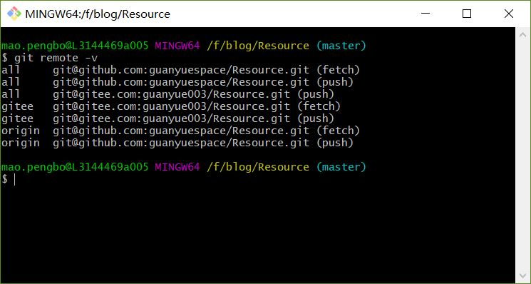
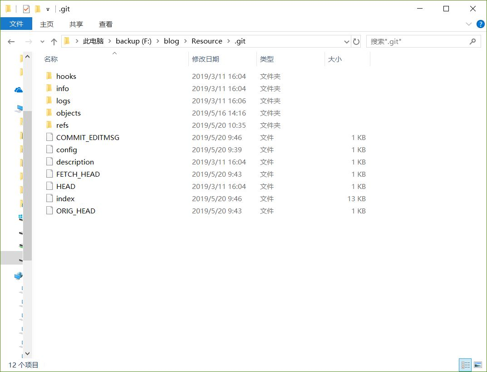
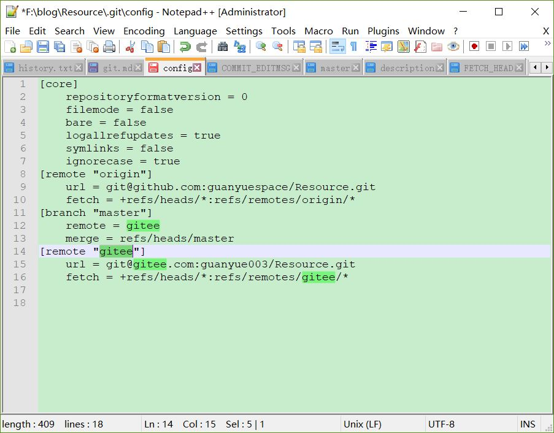

# git使用
>git help pull

## create a new repository
```sh
git init
git add README.md
git rm -r --cached .
git commit -m "first commit"
git remote add origin git@github.com:guanyuespace/OK.git
git push -u origin master
git pull --allow-unrelated-histories                        # 远程拉取unrelated histories 

git checkout -b test

git push remote-name local-branch-name
git push remote-name local-branch-name:remote-branch-name
git push remote-name :remote-branch-name                    # 删除远程分支

git fetch remote-name
git checkout --track remote-name/remote-branch-name
git checkout -b new-local-branch-name remote-name/remote-branch-name

git checkout -b test # do something
git rebase master # 变基操作，作用相当于git merge, 优化了提交历史
git rebase --onto master server client

git log --abbrev-commit --pretty=oneline # commit-log查看

git stash   # 切换分支时保留暂存而不想进行提交
git stash save . "comments"
git stash list
git stash apply stash@{0} # stash@{0}获取最新的存储,stash@{1}获取次新.stash@{2.hour.ago}获取两小时之前的. 存储可以直接通过索引的位置来获得stash@{n}.
git stash drop stash@{0}
```
## commit
```sh
git commit --amend --author='guanyuespace <guanyue003@gmail.com>'
```
##  push an existing repository from the command line
```sh
git remote add origin git@github.com:guanyuespace/OK.git
git push -u origin master
```

## multi remote 

```
.git/config  

[remote "all"]  
    url = git@github.com:guanyuespace/Resource.git
    url = git@gitee.com:guanyue003/Resource.git
    
    
git pull all --all # 同时提交到两个远程仓库
```

     
可以看到同时push到两个远程仓库，只从github拉取,ok.... ...


### .git文件结构

    

| 文件 | desp |
| --- | --- |
| logs | commit日志，push-pull信息 |
| objects | 存储的文件二进制对象 |
| COMMIT_EDITMSG | recent commit-msg |
| config | branch, remote-branch |
| index | 暂存区,二进制文件，stage  |

       
参考：[.git文件夹](https://blog.csdn.net/mayfla/article/details/78653396)     


### git忽略规则
```sh
#此为注释 – 内容被 Git 忽略
.sample 　　      # 忽略所有 .sample 结尾的文件
!lib.sample 　　  # 但 lib.sample 除外
/TODO 　　        # 仅仅忽略项目根目录下的 TODO 文件，不包括 subdir/TODO
build/ 　　       # 忽略 build/ 目录下的所有文件
build/*           # 忽略build以及其子目录下的所有文件
doc/*.txt 　　    # 会忽略 doc/notes.txt 但不包括 doc/server/arch.txt
```

### .gitignore规则不生效的解决办法
把某些目录或文件加入忽略规则，按照上述方法定义后发现并未生效，原因是.gitignore只能忽略那些原来没有被追踪的文件，如果某些文件已经被纳入了版本管理中，则修改.gitignore是无效的。那么解决方法就是先把本地缓存删除（改变成未被追踪状态），然后再提交：
```sh
git rm -r --cached .
git add .
git commit -m 'update .gitignore'
```

---
# Git基础
>[Git 基础](https://git-scm.com/book/zh/v1/Git-%E5%9F%BA%E7%A1%80-%E5%8F%96%E5%BE%97%E9%A1%B9%E7%9B%AE%E7%9A%84-Git-%E4%BB%93%E5%BA%93)

## 简要
>git help command: git help config

```sh
git init
git clone git@github.com:guanyuespace/OK.git MyDirName

git status # 简略查看暂存中做出了哪些更改
git diff # 查看尚未暂存的文件更新了哪些部分
git diff --cached # 已经暂存起来的文件和上次提交时的快照之间的差异
git diff --staged # 同上 --cached

git commit -m "comments here"
git commit -a # 跳过git add

git rm --cached readme.md # 删除暂存区而不删除本地文件，删除误添加本地文件
git rm \*~

git mv file_from file_to # Git 并不跟踪文件移动操作,just like: mv file_from file_to; git rm file_from; git add file_to  
git mv readme.md README.md

git log # 显示所有提交历史commit-id(sha-1)
git log --max-count 2 # 显示最近的两次提交历史（行层面的对比，+,-）
git log -U1 --word-diff # 单词层面的对比
git log -stat # 摘要：显示更改的行数
git log --pretty "格式" # 自定义格式显示提交变化

git show commit-id # git show sha-1_code 显示本次提交的更改    

git commit --amend # 减少提交次数

git reset HEAD README.md # 撤销暂存中README.md的修改
git checkout  -README.md # 撤销本地文件中本次的更改！！！

git remote add shortname url # 添加远程仓库

git tag # 显示所有标签
git tag -l 'v0.0.*' # 列出:v0.0.1 v0.0.2 ....
```


---
# 打标签
记录某一时刻的版本，与git commit之间...
## 新建标签
Git 使用的标签有两种类型：轻量级的（lightweight）和含附注的（annotated）。   
**轻量级标签就像是个不会变化的分支，实际上它就是个指向特定提交对象的引用。**    
**含附注标签，实际上是存储在仓库中的一个独立对象，** 它有自身的校验和信息，包含着标签的名字，电子邮件地址和日期，以及标签说明.   
标签本身也允许使用 `GNU Privacy Guard (GPG)` 来签署或验证。   
一般我们都建议使用含附注型的标签，以便保留相关信息；当然，如果只是临时性加注标签，或者不需要旁注额外信息，用轻量级标签也没问题。

## 含附注的标签
创建一个含附注类型的标签非常简单，用 `-a` （译注：取 `annotated` 的首字母）指定标签名字即可：   

```sh
git tag -a v0.0.9 -m 'test version v0.0.9'

git show v0.0.9 # just like: git show commit-id

$ git tag -u E031D280CA50F902CB68A8BBF1C6C99D6C9E65C0 -s v1.0.0 -m 'signed by gpg-signature'


$ git show v1.0.0
tag v1.0.0
Tagger: guanyuespace <XXXXXXX@XXX>
Date:   Tue May 7 10:44:50 2019 +0800

signed by gpg-signature
-----BEGIN PGP SIGNATURE-----

iQEzBAABCAAdFiEE4DHSgMpQ+QLLaKi78cbJnWyeZcAFAlzQ8SIACgkQ8cbJnWye
ZcCl1Qf+Lhv3LjMIZSPItm7Qmz9+cxuZkFXXm11KGRRm4F0mUDVy3W1AYaTxaRs3
c7YEMnZqcfjxwU6rBvE0Y2jw9Ymo+FYRCpOcsq2vhiupW0eSflZzGbBcGamNiB0D
kpytQUxq2VopqV5eNMeQd/iLEVAHXmzzY5Yn5NpLcbsW9jQL/YRHYEtUbplSyV28
fpyfFC0gNSM4GPkpZrgNuJH/oLijBBpJMDEpmzJHs993IcpLf7laIbDUJUdTN/D8
oio/POkVZ8/DMDiS5iX5GcD9qoW+CmUcdbVDQIotSqiwKcmYovvKWSlU5ST/fAK6
0NhmP6RfvA4hSewpl90yTiv5C58L9A==
=1+ql
-----END PGP SIGNATURE-----

commit 4bfb46c3a88563a7a8a445337e157d10a413466f (HEAD -> master, tag: v1.0.0, tag: v0.9.9, origin/master, origin/HEAD)
Author: guanyuespace <guanyue003@gmail.com>
Date:   Sun Apr 28 22:01:06 2019 +0800

    guanyue-home review

    scroll-view

diff --git a/pages/music/lyric/lyric.wxml b/pages/music/lyric/lyric.wxml
index 5ca634d..d4045a6 100644
--- a/pages/music/lyric/lyric.wxml
+++ b/pages/music/lyric/lyric.wxml
@@ -1,59 +1,59 @@
-<!--pages/music/music_lyric/music_lyric.wxml-->
-<view>
-  <!-- 背景虚化 -->
-  <view class="background_img" id="wtf" data-hel='whhhh'>
-    <image class="bg" src="{{bg}}"></image>
-  </view>


$ git tag -v v1.0.0  # 验证标签
gpg: Signature made 2019年05月 7日 10:44:50
gpg:                using RSA key E031D280CA50F902CB68A8BBF1C6C99D6C9E65C0
gpg: Good signature from "guanyue (generate gpg-key test) <guanyue003@gmail.com>" [ultimate]
object 4bfb46c3a88563a7a8a445337e157d10a413466f
type commit
tag v1.0.0
tagger guanyuespace <XXXXXXX@XXX> 1557197090 +0800

signed by gpg-signature
```

##  轻量级标签
轻量级标签实际上就是一个保存着对应提交对象的校验和信息的文件。要创建这样的标签，一个 -a，-s 或 -m 选项都不用，直接给出标签名字即可：   
`$ git tag v1.4-lw`   

## 分享标签
默认情况下，`git push` 并不会把标签传送到远端服务器上，只有通过显式命令才能分享标签到远端仓库。其命令格式如同推送分支，运行 `git push [remote-name] [tagname]`,或者一次推送所有标签`git push [remote-name] --tags`    

---
# GPG
```sh

$ gpg --full-generate-key
gpg (GnuPG) 2.2.9-unknown; Copyright (C) 2018 Free Software Foundation, Inc.
This is free software: you are free to change and redistribute it.
There is NO WARRANTY, to the extent permitted by law.

Please select what kind of key you want:
   (1) RSA and RSA (default)
   (2) DSA and Elgamal
   (3) DSA (sign only)
   (4) RSA (sign only)
Your selection? 1
RSA keys may be between 1024 and 4096 bits long.
What keysize do you want? (2048) 2048
Requested keysize is 2048 bits
Please specify how long the key should be valid.
         0 = key does not expire
      <n>  = key expires in n days
      <n>w = key expires in n weeks
      <n>m = key expires in n months
      <n>y = key expires in n years
Key is valid for? (0) 3m
Key expires at 2019年08月 5日 10:23:27
Is this correct? (y/N) y

GnuPG needs to construct a user ID to identify your key.

Real name: guanyue
Email address: guanyue003@gmail.com
Comment: generate gpg-key test
You selected this USER-ID:
    "guanyue (generate gpg-key test) <guanyue003@gmail.com>"

Change (N)ame, (C)omment, (E)mail or (O)kay/(Q)uit? O
We need to generate a lot of random bytes. It is a good idea to perform
some other action (type on the keyboard, move the mouse, utilize the
disks) during the prime generation; this gives the random number
generator a better chance to gain enough entropy.
We need to generate a lot of random bytes. It is a good idea to perform
some other action (type on the keyboard, move the mouse, utilize the
disks) during the prime generation; this gives the random number
generator a better chance to gain enough entropy.
gpg: key F1C6C99D6C9E65C0 marked as ultimately trusted
gpg: revocation certificate stored as '/c/Users/XXXXXXX/.gnupg/openpgp-revocs.d/E031D280CA50F902CB68A8BBF1C6C99D6C9E65C0.rev'
public and secret key created and signed.

pub   rsa2048 2019-05-07 [SC] [expires: 2019-08-05]
      E031D280CA50F902CB68A8BBF1C6C99D6C9E65C0
uid                      guanyue (generate gpg-key test) <guanyue003@gmail.com>
sub   rsa2048 2019-05-07 [E] [expires: 2019-08-05]

$ gpg --list-keys

$ gpg --delete-secret-keys [用户id] # 删除私钥  用户id也可以用pubkey替换
# 即 gpg --delate-secret-keys E031D280CA50F902CB68A8BBF1C6C99D6C9E65C0 或 gpg --delete-secret-keys guanyue
$ gpg --delete-key [用户id]         # 删除公钥(先删除私钥再公钥)

$ gpg --armor --output public-key.txt --export E031D280CA50F902CB68A8BBF1C6C99D6C9E65C0 # 以ASCII码导出公钥
$ gpg --armor --output private-key.txt --export-secret-keys guanyue # 导出私钥

$ gpg --keyserver hkp://subkeys.pgp.net --send-keys [用户ID] # 上传公钥
$ gpg --fingerprint [用户 ID] # 签名，自签证明

$ gpg --import [密钥文件]                 # 从密钥文件导入
$ gpg --keyserver hkp://subkeys.pgp.net --search-keys [用户ID] # 从密钥服务器导入     
```
## 加解密

```sh
$ gpg  --recipient E031D280CA50F902CB68A8BBF1C6C99D6C9E65C0 --output result.txt --encrypt src.txt
$ gpg  --recipient E031D280CA50F902CB68A8BBF1C6C99D6C9E65C0 --output src.txt --decrypt result.txt
```

## 签名及验证
```sh
$ gpg --sign src.txt # 对src.txt生成二进制签名 文件：src.txt.gpg
$ gpg --clearsign src.txt # 对src.txt生成scaii签名 文件：src.txt.asc

$ gpg --verify src.asc
```

如果想生成单独的签名文件，与文件内容分开存放，可以使用 detach-sign 参数。   
`gpg --detach-sign demo.txt`    
运行上面的命令后，当前目录下生成一个单独的签名文件 demo.txt.sig。该文件是二进制形式的，如果想采用 ASCII 码形式，要加上 armor 参数。   
`gpg --armor --detach-sign demo.txt`   


```sh
$ cat src.txt
hello yue

$ gpg --clearsign src.txt

$ cat src.txt.asc
-----BEGIN PGP SIGNED MESSAGE-----
Hash: SHA256

hello yue
-----BEGIN PGP SIGNATURE-----

iQEzBAEBCAAdFiEE4DHSgMpQ+QLLaKi78cbJnWyeZcAFAlzQ9ssACgkQ8cbJnWye
ZcD0Vgf/RwnyLdMbgtSkE2B2CApl77Cbv2YSA8pWHDQ+ZEwI5ExPL7+zEGduiQLv
cz1sdE0xW5uyEVR31wEB66KIHmkdeOOSi8ua7Xose6zSvaYoU653WtHxaAyIni/l
WSm41LcykNuiDStKUC7ZqmA9VMf75xZq2Cbt5LJBtbiGxdRBdR0+gKghd4R96f1d
Thk2I3ope/c5gobdEBQXl4qMNDgOJahDhZQojIf7YwFIojWyVKTo6NO9fVae21yO
J+GiJY7fvJiAJif3Gw6YaJQcz41OnOniKJWrM60iz9+/6SPWDIyzZy0fuJWo9DGg
mthMHFZDhv7j1cCLJDBOqZB1foMYkw==
=eZye
-----END PGP SIGNATURE-----


$ gpg --armor --detach-sign src.txt
File 'src.txt.asc' exists. Overwrite? (y/N) y


$ cat src.txt.asc
-----BEGIN PGP SIGNATURE-----

iQEzBAABCAAdFiEE4DHSgMpQ+QLLaKi78cbJnWyeZcAFAlzQ9w0ACgkQ8cbJnWye
ZcA4iAgAohlYLUWIEEk3iq01RUQ6HkZB77aafUbhHrOelfv8dMhu7xoaCCt7wPvy
7bMikToOKgIRN7l4eGO44H3zSRcFdH/jBBNEiY6ELIW0G27djU1wgWtiRFjLRjCt
bym1v4BC0Ny5DqH93DBsMrXewLDCWWUCxiWDYc3m7mI2SIlN6KhyMPBgfWgyHHZa
bKeQYb8iBxf3Euwf2qrZw6mGJSVsxVM4kWYVWrTJE/OFFdlSS5rT4WEWVdoBpqCH
OztTfBYEkfE0bdtuSrKpFnHKBGSCM/B1hgNiy+avR/ccNvrPwuBlS1REgAayk5Wg
qEj0FxJ3i4ZhbMIvspQxH4P0+wppuA==
=iv1v
-----END PGP SIGNATURE-----


$ gpg --verify src.txt.asc
gpg: assuming signed data in 'src.txt'
gpg: Signature made 2019年05月 7日 11:10:05
gpg:                using RSA key E031D280CA50F902CB68A8BBF1C6C99D6C9E65C0
gpg: Good signature from "guanyue (generate gpg-key test) <guanyue003@gmail.com>" [ultimate]
```

---
# 远程仓库

```sh
git remote # 显示**远程仓库**     shortname
git remote -v # 显示**远程仓库**  shortname url

git fetch shortname # 获取远程仓库的更改，拉取到本地仓库而非本地目录
git pull # 获取远程更改到本地文件

git push remote-name branch-name # 本地仓库中的数据推送到远程仓库 remote-name:shortname

git remote show remote-name # 远程仓库信息

git remote rename remote-name new-remote-name # 修改远程仓库shortname
git remote rm remote-name # 删除远程仓库
```

---
# 撤销操作
>减少非必要，无关提交  
减少提交次数

```sh
git commit --amend
```

如果刚才提交时忘了暂存某些修改，可以先补上暂存操作，然后再运行 --amend 提交：

```sh
$ git commit -m 'initial commit'
$ git add forgotten_file
$ git commit --amend
```

**上面的三条命令最终只是产生一个提交，第二个提交命令修正了第一个的提交内容。**    

# 取消暂存

接下来的两个小节将演示如何取消暂存区域中的文件，以及如何取消工作目录中已修改的文件。不用担心，查看文件状态的时候就提示了该如何撤消，所以不需要死记硬背。来看下面的例子，有两个修改过的文件，我们想要分开提交，但不小心用 git add . 全加到了暂存区域。该如何撤消暂存其中的一个文件呢？其实，git status 的命令输出已经告诉了我们该怎么做：
```sh
$ git add .
$ git status
On branch master
Changes to be committed:
  (use "git reset HEAD <file>..." to unstage)

        modified:   README.txt
        modified:   benchmarks.rb
```

就在 “Changes to be committed” 下面，括号中有提示，可以使用 git reset HEAD <file>... 的方式取消暂存。好吧，我们来试试取消暂存 benchmarks.rb 文件：
```sh
$ git reset HEAD benchmarks.rb
Unstaged changes after reset:
M       benchmarks.rb
$ git status
On branch master
Changes to be committed:
  (use "git reset HEAD <file>..." to unstage)

        modified:   README.txt

Changes not staged for commit:
  (use "git add <file>..." to update what will be committed)
  (use "git checkout -- <file>..." to discard changes in working directory)

        modified:   benchmarks.rb
```        
这条命令看起来有些古怪，先别管，能用就行。现在 benchmarks.rb 文件又回到了之前已修改未暂存的状态。

# 取消对文件的修改
如果觉得刚才对 benchmarks.rb 的修改完全没有必要，该如何取消修改，回到之前的状态（也就是修改之前的版本）呢？git status 同样提示了具体的撤消方法，接着上面的例子，现在未暂存区域看起来像这样：

```sh
Changes not staged for commit:
  (use "git add <file>..." to update what will be committed)
  (use "git checkout -- <file>..." to discard changes in working directory)

        modified:   benchmarks.rb
```

在第二个括号中，我们看到了抛弃文件修改的命令（至少在 Git 1.6.1 以及更高版本中会这样提示，如果你还在用老版本，我们强烈建议你升级，以获取最佳的用户体验），让我们试试看：

```sh
$ git checkout -- benchmarks.rb
$ git status
On branch master
Changes to be committed:
  (use "git reset HEAD <file>..." to unstage)

        modified:   README.txt
```

可以看到，该文件已经恢复到修改前的版本。 **你可能已经意识到了，这条命令有些危险，所有对文件的修改都没有了，因为我们刚刚把之前版本的文件复制过来重写了此文件。所以在用这条命令前，请务必确定真的不再需要保留刚才的修改。如果只是想回退版本，同时保留刚才的修改以便将来继续工作，可以用下章介绍的 stashing 和分支来处理，应该会更好些。**  

**记住，任何已经提交到 Git 的都可以被恢复。** 即便在已经删除的分支中的提交，或者用 `--amend` 重新改写的提交，都可以被恢复（关于数据恢复的内容见第九章）。所以，你可能失去的数据，仅限于没有提交过的，对 Git 来说它们就像从未存在过一样。


---
# 忽略某些文件
一般我们总会有些文件无需纳入 `Git` 的管理，也不希望它们总出现在未跟踪文件列表。通常都是些自动生成的文件，比如日志文件，或者编译过程中创建的临时文件等。我们可以创建一个名为 `.gitignore` 的文件，列出要忽略的文件模式。来看一个实际的例子：    

```sh
$ cat .gitignore
*.[oa]
*~
```

第一行告诉 Git 忽略所有以 .o 或 .a 结尾的文件。<!-- 一般这类对象文件和存档文件都是编译过程中出现的，我们用不着跟踪它们的版本。-->   
第二行告诉 Git 忽略所有以波浪符（~）结尾的文件，许多文本编辑软件（比如 Emacs）都用这样的文件名保存副本。<!--此外，你可能还需要忽略 log，tmp 或者 pid 目录，以及自动生成的文档等等。要养成一开始就设置好 .gitignore 文件的习惯，以免将来误提交这类无用的文件。-->

### **文件 .gitignore 的格式规范如下：**

- 所有空行或者以注释符号 ＃ 开头的行都会被 Git 忽略。
- 可以使用标准的 glob 模式匹配。
- **匹配模式最后跟反斜杠（/）说明要忽略的是目录。**  
- **要忽略指定模式以外的文件或目录，可以在模式前加上惊叹号（!）取反。**   
- 所谓的 glob 模式是指 shell 所使用的简化了的正则表达式。   
星号（\*）匹配零个或多个任意字符；  
[abc] 匹配任何一个列在方括号中的字符（这个例子要么匹配一个 a，要么匹配一个 b，要么匹配一个 c）；  
问号（?）只匹配一个任意字符；  
如果在方括号中使用短划线分隔两个字符，表示所有在这两个字符范围内的都可以匹配（比如 [0-9] 表示匹配所有 0 到 9 的数字）。

我们再看一个 .gitignore 文件的例子：
```sh
# 此为注释 – 将被 Git 忽略
# 忽略所有 .a 结尾的文件
*.a
# 但 lib.a 除外
!lib.a
# 仅仅忽略项目根目录下的 TODO 文件，不包括 subdir/TODO
/TODO
# 忽略 build/ 目录下的所有文件
build/
# 会忽略 doc/notes.txt 但不包括 doc/server/arch.txt
doc/*.txt
# 忽略 doc/ 目录下所有扩展名为 txt 的文件
doc/**/*.txt
\*\*/通配符从 Git 版本 1.8.2 以上已经可以使用。
```
