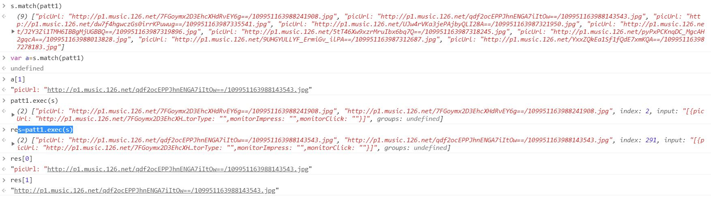
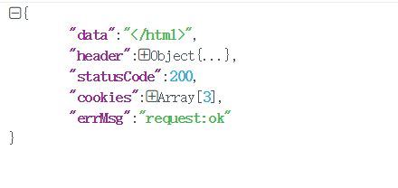
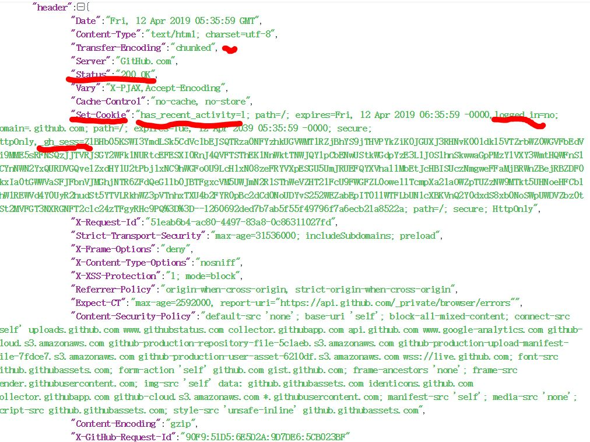
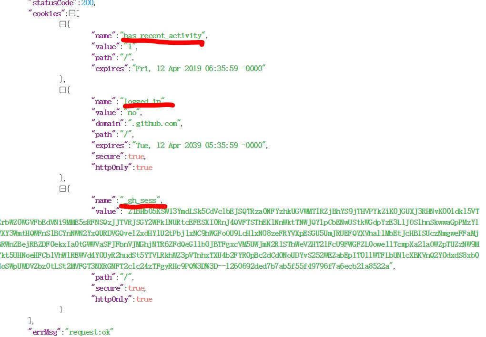

<!-- TOC -->

- [SSL&自签名证书](#ssl%E8%87%AA%E7%AD%BE%E5%90%8D%E8%AF%81%E4%B9%A6)
- [微信小程序样式](#%E5%BE%AE%E4%BF%A1%E5%B0%8F%E7%A8%8B%E5%BA%8F%E6%A0%B7%E5%BC%8F)
  - [iconfont](#iconfont)
    - [矢量图标的使用](#%E7%9F%A2%E9%87%8F%E5%9B%BE%E6%A0%87%E7%9A%84%E4%BD%BF%E7%94%A8)
- [网易云音乐](#%E7%BD%91%E6%98%93%E4%BA%91%E9%9F%B3%E4%B9%90)
  - [轮播图api](#%E8%BD%AE%E6%92%AD%E5%9B%BEapi)
  - [Bugs](#bugs)
    - [setData](#setdata)
  - [数据处理](#%E6%95%B0%E6%8D%AE%E5%A4%84%E7%90%86)
    - [数组相关](#%E6%95%B0%E7%BB%84%E7%9B%B8%E5%85%B3)
      - [添加对象](#%E6%B7%BB%E5%8A%A0%E5%AF%B9%E8%B1%A1)
    - [滚动](#%E6%BB%9A%E5%8A%A8)
    - [urlencode](#urlencode)
      - [Javascript](#javascript)
    - [Java 正则表达式贪婪模式&非贪婪模式](#java-%E6%AD%A3%E5%88%99%E8%A1%A8%E8%BE%BE%E5%BC%8F%E8%B4%AA%E5%A9%AA%E6%A8%A1%E5%BC%8F%E9%9D%9E%E8%B4%AA%E5%A9%AA%E6%A8%A1%E5%BC%8F)
    - [Javascript正则表达式](#javascript%E6%AD%A3%E5%88%99%E8%A1%A8%E8%BE%BE%E5%BC%8F)
- [GitHub](#github)
  - [登陆](#%E7%99%BB%E9%99%86)
  - [登出](#%E7%99%BB%E5%87%BA)
  - [stats请求： ????](#stats%E8%AF%B7%E6%B1%82-)
  - [小程序请求Cookie](#%E5%B0%8F%E7%A8%8B%E5%BA%8F%E8%AF%B7%E6%B1%82cookie)
    - [请求后的数据](#%E8%AF%B7%E6%B1%82%E5%90%8E%E7%9A%84%E6%95%B0%E6%8D%AE)
    - [Cookie相关](#cookie%E7%9B%B8%E5%85%B3)
    - [Cookie设置](#cookie%E8%AE%BE%E7%BD%AE)
- [163Mail](#163mail)
- [Java 正则表达式介绍](#java-%E6%AD%A3%E5%88%99%E8%A1%A8%E8%BE%BE%E5%BC%8F%E4%BB%8B%E7%BB%8D)
  - [贪婪模式表达式：](#%E8%B4%AA%E5%A9%AA%E6%A8%A1%E5%BC%8F%E8%A1%A8%E8%BE%BE%E5%BC%8F)
  - [非贪婪模式表达式：](#%E9%9D%9E%E8%B4%AA%E5%A9%AA%E6%A8%A1%E5%BC%8F%E8%A1%A8%E8%BE%BE%E5%BC%8F)
- [Problem](#problem)

<!-- /TOC -->

# SSL&自签名证书

- openssl
- keytool

---
# 微信小程序样式


## iconfont
### 矢量图标的使用
[iconfont字体图标的使用](http://www.cnblogs.com/fashandian/p/6880892.html)    


- 选取图标
- 添加到项目
- 下载代码ok
- demo.html

open-data

radius

---
# 网易云音乐
```
path: /discover
```

## 轮播图api
> pc端实现（user_agent设置,but 微信小程序无法进行user agent设置）

**搭建HTTPS服务器实现**

## Bugs

### setData
原因：组件实例刚刚被创建好时， created 生命周期被触发。此时，组件数据 this.data 就是在 Component 构造器中定义的数据 data 。 此时还不能调用 setData 。 通常情况下，这个生命周期只应该用于给组件 this 添加一些自定义属性字段。<!-- Lyric尚未进行onLoad,onShow...-->     


操作从lyric.wxml  redictTo music.wxml
歌词页面跳转到详细歌单界面

onShow ---&gt; (跳过onHide)  ---&gt;onUnload

从首页跳转到详情页,点击左上方的返回按钮,详情页的onHide不触发微信小程序

<!--
onHide：监听页面的隐藏
当从当前 A 页跳转到其他页面，那么 A 页面处于隐藏状态。
onUnload：监听页面的卸载
当前处于 A 页面，点击返回按钮时，则将是 A 页面卸载。
https://blog.csdn.net/hhf235678/article/details/78749952
-->

- log
```
lyricPage onLoad options={"id":"571463522","name":"生如逆旅（Cover 米津玄师）","bg":"http%3A%2F%2Fp1.music.126.net%2FhzlpZj9bzwyk1b0g7Deo0A%3D%3D%2F109951163335209234.jpg"}
lyric.js? [sm]:149 lyricPage onShow
playlists.js? [sm]:83 play ..... lyricPage=[object Object]
lyric.js? [sm]:76 lyricPage lyric setDurations start
lyric.js? [sm]:169 lyricPage onUnload
playlists.js? [sm]:83 play ..... lyricPage=[object Object]
lyric.js? [sm]:76 lyricPage lyric setDurations start
```
onShow ---&gt; (跳过onHide)  ---&gt;onUnload

- JS   
```js
console.log("lyricPage lyric setDurations start");
  var all;
if (this.data.temp != 0)
    clearInterval(this.data.temp);
this.data.temp =
  setInterval(() => {
     all = app.globalData.audioPlayer.duration;
     console.log("all= " + all + "\t temp_timer=" + this.data.temp);
     var mintues = Math.floor(all / 60);
     var seconds = Math.floor(all - mintues * 60);
     this.setData({
       durations: mintues > 9 ? mintues + ":" + (seconds > 9 ? seconds : "0" + seconds) : "0" + mintues + ":" + (seconds > 9 ? seconds : "0" + seconds)
     }, () => {
       //另外 尚未执行onLoad, onShow ....
       //逻辑？？？？
       //////此处不会执行
       console.log("------------------> " + this.data.durations + "\t" + all);
       if (all && all != 0)
         clearInterval(this.data.temp);
     });
  }, 50);
```

## 监听蓝牙&耳机连接
控制音乐播放...


<!-- Android ok... -->
## 数据处理

### 数组相关
- splice
```js
splice(index, length,data...)   
从index开始操作,将length个元素替换成data
并返回length个元素
```

- shift/unshift    
从数组头部删除/添加

- pop/push   
从数组尾部删除添加


#### 添加对象
1. JSON.parse()
```js
that.data.lyric_time.push(JSON.parse("{\"secs\":\"" + secs + "\",\"str\":\"" + str + "\"}"));
```
2. ok
```
that.data.lyric_time.push({
  secs: secs,
  str: str
});
```
方法一`parse`注意特殊字符... 字符串构造巨坑!!!

### 滚动
- transform    
布局文件
```xml
<view style="transform: translateY({{(4-curIndex)*900/9}}rpx)" wx:for="{{lyric_time}}" wx:key="item" wx:for-item="item" wx:for-index="idx">
      <text class="{{lastTime==item.secs?'highlight':'common'}}" data-time="{{item.secs}}">{{item.str}}</text>
</view>
```
<!-- 屏幕铺满可以显示9行， (4-curIndex)*(900/9)间距，第5行与curIndex之间的间距，负数向上移动，整数向下移动 -->

- order    
CSS层叠样式表
```css
.show {
  order: 1;
  mix-blend-mode: difference;
  filter: invert(1);
  -webkit-filter: invert(1);/**-webkit:表示chrome与safari特有属性  */
   color: green;
}
```
XML布局文件
```xml
<text hidden="{{lastTime==item.secs?false:true}}" class="show" wx:key="item" wx:for="{{lyric_time}}" wx:for-item="item" wx:for-index="idx">{{item.str}}</text>
```
- scroll-view       
可滚动视图区域。**使用竖向滚动时，需要给&lt;scroll-view&gt;一个固定高度，通过 WXSS 设置 height。组件属性的长度单位默认为px，2.4.0起支持传入单位(rpx/px)。**

|属性	|类型	|默认值	|必填	|说明	|最低版本|
|----|
|scroll-x	|boolean	|false	|否	|允许横向滚动|	1.0.0|
|scroll-y	|boolean	|false	|否	|允许纵向滚动|	1.0.0|
|upper-threshold	|number/string|	50	|否	|距顶部/左边多远时，触发 scrolltoupper 事件	|1.0.0|
|lower-threshold	| number/string |	50	|否|	距底部/右边多远时，触发 scrolltolower 事件	| 1.0.0 |
|scroll-top	| number/string ||		否 |	设置竖向滚动条位置	| 1.0.0 |
|scroll-left	| number/string |	|	否 |	设置横向滚动条位置	| 1.0.0 |
|scroll-into-view	|string	|	|否 |	值应为某子元素id（id不能以数字开头）。设置哪个方向可滚动，则在哪个方向滚动到该元素	| 1.0.0 |
|scroll-with-animation	| bollean |	false	| 否 |	在设置滚动条位置时使用动画过渡	| 1.0.0 |
|enable-back-to-top	| bollean |	false	| 否 |	iOS点击顶部状态栏、安卓双击标题栏时，滚动条返回顶部，只支持竖向	| 1.0.0 |
|bindscrolltoupper	| eventhandle |		|否 |	滚动到顶部/左边时触发	| 1.0.0 |
|bindscrolltolower	| eventhandle |		|否 |	滚动到底部/右边时触发	| 1.0.0 |
|bindscroll	| eventhandle |		|否 |	滚动时触发，event.detail = {scrollLeft, scrollTop, scrollHeight, scrollWidth, deltaX, deltaY}

- Tips    
  1. **请勿在 scroll-view 中使用 textarea、map、canvas、video 组件**
  2. scroll-into-view 的优先级高于 scroll-top
  3. 在滚动 scroll-view 时会阻止页面回弹，所以在 scroll-view 中滚动，是无法触发 onPullDownRefresh
  4. 若要使用下拉刷新，请使用页面的滚动，而不是 scroll-view ，这样也能通过点击顶部状态栏回到页面顶部


### urlencode
>***problem： get url?param=value (value has character like '=','&'etc)***

#### Javascript
- **escape()**   
采用ISO Latin字符集对指定的字符串进行编码。所有的 **空格符、标点符号、特殊字符以及其他非ASCII字符** 都将被转化成%xx格式的字符编码（xx等于该字符在字符集表里面的编码的16进制数字）。比如，空格符对应的编码是%20。   
***不会被此方法编码的字符： @ * / +***

- **encodeURI()**   
把URI字符串采用UTF-8编码格式转化成escape格式的字符串。   
***不会被此方法编码的字符：! @ # $& * ( ) = : / ; ? + '***

- **encodeURIComponent()**   
把URI字符串采用UTF-8编码格式转化成escape格式的字符串。与encodeURI()相比，这个方法将对更多的字符进行编码，比如 / 等字符。所以如果字符串里面包含了URI的几个部分的话，不能用这个方法来进行编码，否则 / 字符被编码之后URL将显示错误。   
***不会被此方法编码的字符：! * ( ) '***    

因此，对于中文字符串来说，如果不希望把字符串编码格式转化成UTF-8格式的（比如原页面和目标页面的charset是一致的时候），只需要使用 escape。如果你的页面是GB2312或者其他的编码，而接受参数的页面是UTF-8编码的，就要采用encodeURI或者 encodeURIComponent。


### Java 正则表达式贪婪模式&非贪婪模式
```java
Pattern pattern = Pattern.compile("window.Gbanners =[\n|\r\n](\\[.*?]);", Pattern.DOTALL);   //非贪婪模式匹配... 假如：数组元素也是数组?? so how can i do it
Matcher matcher = pattern.matcher(str);
if (matcher.find()) {
   return matcher.group(1);
}
```
***如果数组元素中也含有数组？？？ how ??***
```java
private static void test() {
    Pattern p = Pattern.compile("window.Gbanners =\n(\\[.*?]);", Pattern.DOTALL);
    String str = "window.Gbanners =\n[hello, what happened ? [bye];....];endherehello[yue];";
    Matcher matcher = p.matcher(str);
    if (matcher.find())
        System.out.println(matcher.group(1));
    else
        System.out.println("???");
}
```
***如何提取"[hello, what happened ? [bye];....]"??***        
***麻烦：***    
```java
String str = "window.Gbanners =\n[hello, what happened ? [bye];[yue];....];hello[yue];";
p=Pattern.compile("window.Gbanners =\n(\\[[\\w\\d\\,\\?\\s]+(\\[\\w+\\];)+\\.+\\]);");
Matcher matcher = p.matcher(str);
matcher.find();
System.out.println(matcher.group(1));
```
**Result: [hello, what happened ? [bye];[yue];....]**


### Javascript正则表达式
```js
var patt1=/picUrl\s+:\s+\"([\w|\d|\\.|\\/|:|=]+)\"/g;
var s="[{picUrl: \"http://p1.music.126.net/7FGoymx2D3EhcXHdRvEY6g==/109951163988241908.jpg\"}......{picUrl: \"http://p1.music.126.net/pyPxPCKnqDC_MgcAH2gqcA==/109951163988013828.jpg\",url: \"https://music.163.com/m/at/5cac89eda987b31a74b53324\",targetId: \"0\",backgroundUrl: \"http://p1.music.126.net/Wj7RwWtJHqZW1znWmZeUyA==/109951163988019180.jpg\",targetType: \"3000\",monitorType: \"\",monitorImpress: \"\",monitorClick: \"\"}, {picUrl: \"http://p1.music.126.net/9UHGYULLYF_ErmiGv_ilPA==/109951163987312687.jpg\",url: \"https://music.163.com/m/at/5cac4505a987b31a74b53247\",targetId: \"0\",backgroundUrl: \"http://p1.music.126.net/f6kKp_6tRoAfs8DcQ241CA==/109951163987307347.jpg\",targetType: \"3000\",monitorType: \"\",monitorImpress: \"\",monitorClick: \"\"}, {picUrl: \"http://p1.music.126.net/YxxZQkEa1Sf1fQdE7xmKQA==/109951163987278183.jpg\",url: \"/album?id=78399447\",targetId: \"78399447\",backgroundUrl: \"http://p1.music.126.net/0e8-38VasU3FF_dNQ1gezg==/109951163987283041.jpg\",targetType: \"10\",monitorType: \"\",monitorImpress: \"\",monitorClick: \"\"}]";

var res=s.match(patt1);
res[0]////picUrl: \"http://p1.music.126.net/7FGoymx2D3EhcXHdRvEY6g==/109951163988241908.jpg\"
// 继续正则表达式

var re;
for(re=patt1.exec(); re!=null; re=patt1.exec()){
  re[0]//picUrl: \"http://p1.music.126.net/7FGoymx2D3EhcXHdRvEY6g==/109951163988241908.jpg\"
  re[1]//http://p1.music.126.net/7FGoymx2D3EhcXHdRvEY6g==/109951163988241908.jpg
}
```
Javascript正则表达式不包含分组概念，使用regex.exec()--->类比分组概念，but 一次获取一个ok...    
    

---
# GitHub
> api：登陆...     
> 由于github.com未在ICP备案因此微信小程序不可直接进行数据请求（自建服务器，不校验）


## 登陆
```
POST /session HTTP/1.1
Host: github.com
Content-Type: application/x-www-form-urlencoded

utf8=%E2%9C%93&authenticity_token=3GKDT3%2BeaF8GThohy848CKypLgt%2FG3eZXFj%2BUorzX%2BVK07sS2%2BJLGTXfxux5W9ptA0epJVdMt%2B3Nl4kTdsy6mA%3D%3D&login=guanyue003%40gmail.com&password=hellogit123

Response:
  Location: https://github.com/

Redict:
  Request URL: https://github.com/
  Request Method: GET

// Html 页面
```

## 登出
```
Request URL: https://github.com/logout
Request Method: GET
--&gt; 登出界面

登出数据
Request URL: https://github.com/logout
Request Method: POST
Content-Type: application/x-www-form-urlencoded

utf8: ✓
authenticity_token://html hidden TEnKx7MjccfdIgtcDe2ibrAxezbhqz5ZotsXiQjNr2BGzljGMSxhHlt4KWlj5Hw5lvz/DIN+5JBzIM53pxVyqg==

Response:
Location: https://github.com/
```

## stats请求： ????

```
Request URL: https://api.github.com/_private/browser/stats
Request Method: POST
Content-Type: application/json; charset=utf-8

data ......

when logout:
{"stats":[{"resourceTimings":[{"initiatorType":"link","nextHopProtocol":"h2","workerStart":0,"redirectStart":0,"redirectEnd":0,"fetchStart":797.6999999955297,"domainLookupStart":0,"domainLookupEnd":0,"connectStart":0,"connectEnd":0,"secureConnectionStart":0,"requestStart":0,"responseStart":0,"responseEnd":1006.6999999980908,"transferSize":0,"encodedBodySize":0,"decodedBodySize":0,"name":"https://github.githubassets.com/assets/mobile-8e8e5b12902d5f04bad25bdd1b689f64.css","entryType":"resource","startTime":797.6999999955297,"duration":209.00000000256114},{"initiatorType":"img","nextHopProtocol":"http/1.1","workerStart":0,"redirectStart":0,"redirectEnd":0,"fetchStart":797.8999999759253,"domainLookupStart":797.8999999759253,"domainLookupEnd":797.8999999759253,"connectStart":797.8999999759253,"connectEnd":797.8999999759253,"secureConnectionStart":0,"requestStart":799.9999999883585,"responseStart":989.3999999912921,"responseEnd":989.899999985937,"transferSize":481,"encodedBodySize":0,"decodedBodySize":0,"name":"https://avatars2.githubusercontent.com/u/31913612?s=40&v=4","entryType":"resource","startTime":797.8999999759253,"duration":192.00000001001172},{"initiatorType":"script","nextHopProtocol":"h2","workerStart":0,"redirectStart":0,"redirectEnd":0,"fetchStart":797.999999980675,"domainLookupStart":0,"domainLookupEnd":0,"connectStart":0,"connectEnd":0,"secureConnectionStart":0,"requestStart":0,"responseStart":0,"responseEnd":803.2999999995809,"transferSize":0,"encodedBodySize":0,"decodedBodySize":0,"name":"https://github.githubassets.com/assets/mobile-bootstrap-6ccc3aa0.js","entryType":"resource","startTime":797.999999980675,"duration":5.300000018905848}],"timestamp":1555033117792},{"navigationTimings":[{"unloadEventStart":792.9999999760184,"unloadEventEnd":792.9999999760184,"domInteractive":800.199999997858,"domContentLoadedEventStart":800.3000000026077,"domContentLoadedEventEnd":800.3000000026077,"domComplete":1013.0999999819323,"loadEventStart":1013.0999999819323,"loadEventEnd":1013.1999999866821,"type":"navigate","redirectCount":0,"initiatorType":"navigation","nextHopProtocol":"http/1.1","workerStart":0,"redirectStart":0,"redirectEnd":0,"fetchStart":4.499999980907887,"domainLookupStart":6.599999993341044,"domainLookupEnd":6.599999993341044,"connectStart":6.599999993341044,"connectEnd":318.7999999790918,"secureConnectionStart":173.39999999967404,"requestStart":322.09999999031425,"responseStart":789.0999999945052,"responseEnd":792.3999999766238,"transferSize":6349,"encodedBodySize":3863,"decodedBodySize":11490,"name":"https://github.com/logout","entryType":"navigation","startTime":0,"duration":1013.1999999866821}],"timestamp":1555033117792}]}
```


## 小程序请求Cookie
### 请求后的数据
```json
{
  "data" : "",//response_body
  "header" : {},//response_header
  "statusCode" : 200,//状态码
  "cookies" : [],//set-Cookie格式化数据
  "errMsg" : "request:ok"
}       
```
  

### Cookie相关   


    

由图可知
cookies设置简化
不用从header中setcookie查找分析
```json
res.cookies[{
  "name":"",//
  "value":"",//
  "path":"",//路径
  "expires":"",//租期
  .....
}]
```


### Cookie设置
```js
wx.setStorageSync("sessionid", res.header["Set-Cookie"])
header = {
    'cookie':wx.getStorageSync("sessionid")//读取cookie
};    
```


---
# 163Mail
> api: 登陆

later  
......


---
# Java 正则表达式介绍
## 贪婪模式表达式：   
贪婪模式  * + {n,} 默认情况是贪婪模式匹配    

|表达式|	含义|
| --- | --- |
|X?	|X，一次或一次也没有|
|X*	|X，零次或多次|
|X+	|X，一次或多次|
|X{n}	|X，恰好 n 次|
|X{n,}	|X，至少 n 次|
|X{n,m}	|X，至少 n 次，但是不超过 m 次|

## 非贪婪模式表达式：   
非贪婪模式，?跟在 * + {n,} 等的后面时，表示非贪婪模式，注意和子表达式后面的?区分开，子表达式后的?表示匹配0次或1次  


|表达式|	含义|
|---|---|
|X??	|X，一次或一次也没有|
|X*?	|X，零次或多次|
|X+?	|X，一次或多次|
|X{n}?	|X，恰好 n 次|
|X{n,}?	|X，至少 n 次|
|X{n,m}?	|X，至少 n 次，但是不超过 m 次|

---
# Problem
in util/core.js
```js
var app=getApp();
```
exception: app undefined ... ...

App() 必须在 app.js 中注册，且不能注册多个。
- 不要在定义于 App() 内的函数中调用 getApp() ，使用 this 就可以拿到 app 实例。
- 不要在 onLaunch 的时候调用 getCurrentPages()，此时 page 还没有生成。
- 通过 getApp() 获取实例之后，不要私自调用生命周期函数。
- 直接修改 this.data 而不调用 this.setData是无法改变页面的状态的，还会造成数据不一致。
- 单次设置的数据不能超过1024kB，请尽量避免一次设置过多的数据。
- 请不要把 data 中任何一项的 value 设为 undefined，否则这一项将不被设置并可能遗留一些潜在问题。


<!--
<style>
	.container{
    overflow: hidden;
    width:800px;
		height:500px;
		background: url(https://s3-us-west-2.amazonaws.com/s.cdpn.io/2017/17_04_cat_bg_03.jpg);
		background-size:cover;
		background-repeat:no-repeat;
    	-webkit-filter:  brightness(0.6);
    	filter:  brightness(0.6);		
	}
	.text{
      color: red;
      font-size: 60px;
      mix-blend-mode: difference;
			padding-top: 80px;
		  -webkit-filter:  invert(1) ;
   		filter:  invert(1) ;
	}
	.txt{
  	-webkit-filter:  invert(1) grayscale(1) contrast(2);
   	filter:  invert(1) grayscale(1) contrast(2);
		font-size: 60px;
		padding-top: 80px;
		text-align:right;		
	}
  .img{
    height:400px;
    width: 400px;
    border-radius: 50%;
    border: 30px solid black;
    transform: rotate(180deg);
  }
  .ani{
    height:400px;
    width: 400px;
    border-radius: 50%;
    border: 30px solid black;
    animation:rotateAni 60s infinite linear;
    -webkit-animation:rotateAni 60s infinite linear;
  }
  @keyframes rotateAni{
    from {
      transform: rotate(0deg);
      -webkit-transform: rotate(0deg);
    }
    to {
      transform: rotate(360deg);
      -webkit-transform: rotate(360deg);
    }
  }
  @-webkit-keyframes rotateAni{
    0% {
      transform: rotate(0deg);
      -webkit-transform: rotate(0deg);
    }
    100% {
      transform: rotate(360deg);
      -webkit-transform: rotate(360deg);
    }
  }
</style>

<div class="container">
	<p class="txt">使图片变亮</p>
  	<div class="text"><p><strong>注意：</strong> Internet Explorer 不支持 filter 属性。 Internet Explorer 不支持 filter 属性。 Internet Explorer 不支持 filter 属性。 Internet Explorer 不支持 filter 属性。 Internet Explorer 不支持 filter 属性。</p></div>
</div>
<div>
  
</div>		
-->
